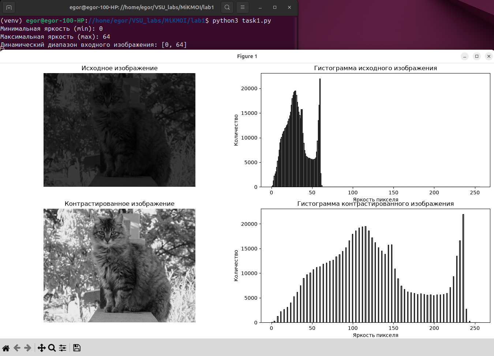
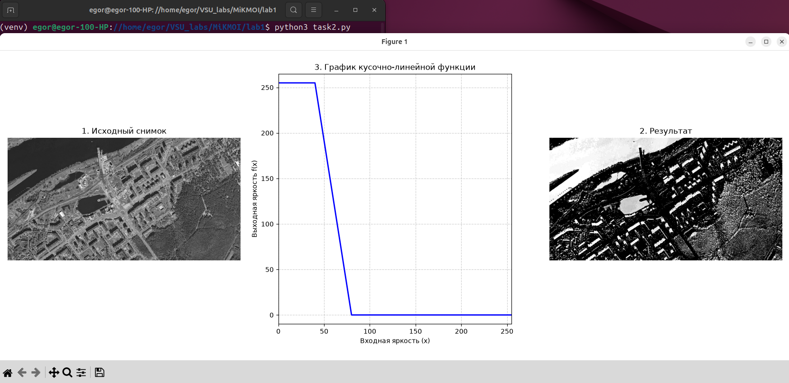
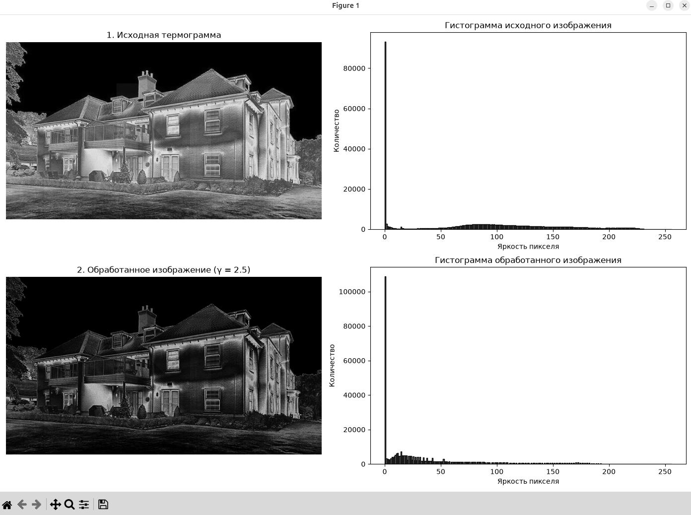
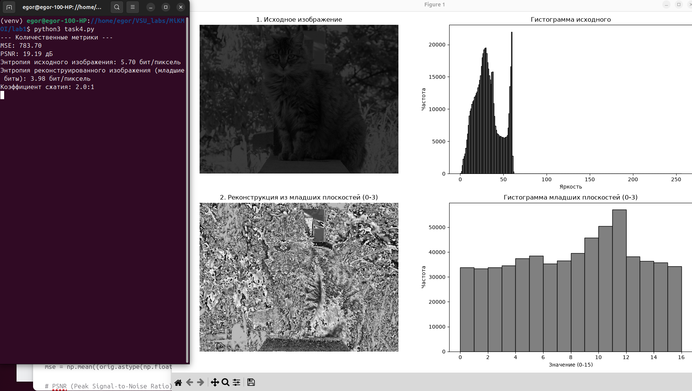

# Математические и компьютерные методы обработки изображений

---

## Лабораторная работа № 1

#### Выполнил: Валиков Егор

#### Группа: 19

---

## Задание 1: Линейное контрастирование изображений

### Задача

Определить динамический диапазон входного изображения. Осуществить линейное контрастирование входного изображения в заданный динамический диапазон яркостей. Вывести изображения и их гистограммы.

### Программа для решения

Ссылка на код: [`task1.py`](task1.py)

```py
import cv2
import matplotlib.pyplot as plt
import numpy as np

# 1. Загрузка исходного изображения
image_path = '4.jpg'
img = cv2.imread(image_path, cv2.IMREAD_GRAYSCALE)

if img is None:
  raise FileNotFoundError(
      f"Ошибка: не удалось загрузить изображение."
  )

# 2. Определение динамического диапазона входного изображения
i_min = np.min(img)
i_max = np.max(img)
print(f'Минимальная яркость (min): {i_min}')
print(f'Максимальная яркость (max): {i_max}')
print(f'Динамический диапазон входного изображения: [{i_min}, {i_max}]')

# 3. Линейное контрастирование в заданный диапазон (0 - 255)
out_min, out_max = 0, 255

def linear_contrast(image, in_min, in_max, out_min, out_max):
  img_float = image.astype(np.float32)

  # Формула линейного контрастирования:
  # g(x,y) = ((f(x,y) - in_min) / (in_max - in_min)) * (out_max - out_min) + out_min
  if in_max == in_min:
    return np.zeros_like(image, dtype=np.uint8)
  out = ((img_float - in_min) / (in_max - in_min) * (out_max - out_min) + out_min)
  out = np.clip(out, out_min, out_max).astype(np.uint8)
  return out

img_contrasted = linear_contrast(img, i_min, i_max, out_min, out_max)

# 4. Вывод изображений и их гистограмм
plt.figure(figsize=(14, 10))

# Исходное изображение
plt.subplot(2, 2, 1)
plt.imshow(img, cmap='gray', vmin=0, vmax=255)
plt.title('Исходное изображение')
plt.axis('off')

# Гистограмма исходного изображения
plt.subplot(2, 2, 2)
plt.hist(img.ravel(), bins=256, range=[0, 256], color='gray', edgecolor='black')
plt.title('Гистограмма исходного изображения')
plt.xlabel('Яркость пикселя')
plt.ylabel('Количество')

# Контрастированное изображение
plt.subplot(2, 2, 3)
plt.imshow(img_contrasted, cmap='gray', vmin=0, vmax=255)
plt.title('Контрастированное изображение')
plt.axis('off')

# Гистограмма контрастированного изображения
plt.subplot(2, 2, 4)
plt.hist(
    img_contrasted.ravel(),
    bins=256,
    range=[0, 256],
    color='gray',
    edgecolor='black',
)
plt.title('Гистограмма контрастированного изображения')
plt.xlabel('Яркость пикселя')
plt.ylabel('Количество')

plt.tight_layout()
plt.show()
```

### Результаты обработки



На скриншоте представлены исходное изображение (слева), контрастированное изображение (справа) и соответствующие им гистограммы распределения яркостей.

### Выводы по результатам

Линейное контрастирование позволило эффективно растянуть узкий исходный диапазон яркостей на всю шкалу $[0, 255]$. На гистограмме видно, что распределение пикселей стало более равномерным, что повысило общую контрастность и визуальную различимость деталей на изображении.

---

## Задание 2: Кусочно-линейное преобразование (Выделение водных объектов)

### Задача

Обработка спутникового снимка (выделение воды):
- Выделить водные объекты (сделать их белыми), остальное — черным.
- Диапазон воды: яркости от 40 до 80.Функция:$f(x) = 255$, если $x < 40$ $f(x) = 255 - 255\frac{x - 40}{40}$, если $40 \le x < 80$ $f(x) = 0$, если $x \ge 80$

### Программа для решения

Ссылка на код: [`task2.py`](task2.py)

```py
import cv2
import matplotlib.pyplot as plt
import numpy as np

# 1. Загрузка исходного изображения
image_path = '2_task.jpg'
img = cv2.imread(image_path, cv2.IMREAD_GRAYSCALE)

if img is None:
  raise FileNotFoundError(
      f"Ошибка: не удалось загрузить изображение."
  )

# 2. Реализация кусочно-линейной функции преобразования яркости
def piecewise_linear_transform_v4(image):
  img_f = image.astype(np.float32)
  out = np.zeros_like(img_f)

  # Условия кусочно-линейной функции:
  mask1 = img_f < 40
  out[mask1] = 255
  mask2 = (img_f >= 40) & (img_f < 80)
  out[mask2] = 255 - 255 * (img_f[mask2] - 40) / 40
  mask3 = img_f >= 80
  out[mask3] = 0

  return out.astype(np.uint8)

img_transformed = piecewise_linear_transform_v4(img)

# 3. Построение графика кусочно-линейной функции преобразования
x_vals = np.arange(0, 256)
y_vals = np.zeros_like(x_vals, dtype=np.float32)

# Расчет графика для визуализации
for i, x in enumerate(x_vals):
  if x < 40:
    y_vals[i] = 255
  elif 40 <= x < 80:
    y_vals[i] = 255 - 255 * (x - 40) / 40
  else:
    y_vals[i] = 0

# 4. Визуализация результатов (Изображения + График функции)
plt.figure(figsize=(15, 5))

# Исходное изображение
plt.subplot(1, 3, 1)
plt.imshow(img, cmap='gray', vmin=0, vmax=255)
plt.title('1. Исходный снимок')
plt.axis('off')

# График функции преобразования
plt.subplot(1, 3, 2)
plt.plot(x_vals, y_vals, color='blue', linewidth=2)
plt.title('3. График кусочно-линейной функции')
plt.xlabel('Входная яркость (x)')
plt.ylabel('Выходная яркость f(x)')
plt.grid(True, linestyle='--', alpha=0.6)
plt.xlim([0, 255])
plt.ylim([-10, 265])

# Преобразованное изображение
plt.subplot(1, 3, 3)
plt.imshow(img_transformed, cmap='gray', vmin=0, vmax=255)
plt.title('2. Результат')
plt.axis('off')

plt.tight_layout()
plt.show()
```

### Результаты обработки



На скриншоте отображены исходный спутниковый снимок, график кусочно-линейной функции и результирующее изображение с выделенными водными объектами.

### Выводы по результатам

Кусочно-линейное преобразование дало возможность избирательно воздействовать на конкретный диапазон яркостей. Заданная функция успешно подавила фоновые элементы ландшафта (землю, растительность) с яркостью $\ge 80$, переведя их в черный цвет, и акцентировала водные объекты, сформировав четкую бинарную маску.

---

## Задание 3: Степенное преобразование (Обработка термограммы)

### Задача

Обработка тепловизионного изображения:
- Обработать термограмму с плавными, малоконтрастными переходами температур с помощью степенного преобразования при $\gamma > 1$.
- Сжать светлые (горячие) тона и растянуть темные (холодные) для выявления перепадов температур.

### Программа для решения

Ссылка на код: [`task3.py`](task3.py)

```py
import cv2
import matplotlib.pyplot as plt
import numpy as np

# 1. Загрузка исходного изображения
image_path = '3_task.jpg'
img = cv2.imread(image_path, cv2.IMREAD_GRAYSCALE)

if img is None:
  raise FileNotFoundError(
      f"Ошибка: не удалось загрузить изображение."
  )

# 2. Применение степенного преобразования (Gamma-коррекция) с γ > 1
gamma = 2.5

def power_law_transform(image, gamma_val):
  # Создаем таблицу перекодировки (LUT) для эффективного применения степенной функции
  # Формула: s = c * (r / 255) ^ gamma * 255, где c = 255
  table = np.array(
      [((i / 255.0) ** gamma_val) * 255 for i in np.arange(0, 256)]
  ).astype('uint8')
  return cv2.LUT(image, table)
img_processed = power_law_transform(img, gamma)

# 3. Визуализация результатов (Изображения и гистограммы)
plt.figure(figsize=(14, 10))

# Исходное изображение
plt.subplot(2, 2, 1)
plt.imshow(img, cmap='gray', vmin=0, vmax=255)
plt.title('1. Исходная термограмма')
plt.axis('off')

# Гистограмма исходного изображения
plt.subplot(2, 2, 2)
plt.hist(
    img.ravel(), bins=256, range=[0, 256], color='dimgray', edgecolor='black'
)
plt.title('Гистограмма исходного изображения')
plt.xlabel('Яркость пикселя')
plt.ylabel('Количество')

# Обработанное изображение
plt.subplot(2, 2, 3)
plt.imshow(img_processed, cmap='gray', vmin=0, vmax=255)
plt.title(f'2. Обработанное изображение (γ = {gamma})')
plt.axis('off')

# Гистограмма обработанного изображения
plt.subplot(2, 2, 4)
plt.hist(
    img_processed.ravel(),
    bins=256,
    range=[0, 256],
    color='dimgray',
    edgecolor='black',
)
plt.title('Гистограмма обработанного изображения')
plt.xlabel('Яркость пикселя')
plt.ylabel('Количество')

plt.tight_layout()
plt.show()
```

### Результаты обработки



На скриншоте представлены исходная термограмма и обработанное степенное изображение вместе с их гистограммами.

### Выводы по результатам

Выбор степенной функции (гамма-коррекции) с параметром $\gamma > 1$ обоснован необходимостью нелинейного перераспределения уровней яркости. Это позволило визуально усилить градиенты в темной зоне (холодные участки), сделав скрытые на исходном снимке перепады температур очевидными и легко читаемыми для оператора.

---

## Задание 4: Работа с битовыми плоскостями (Реконструкция из младших плоскостей)

### Задача

Собрать изображение, используя только младшие 4 плоскости (биты 0, 1, 2, 3). Оценить качество и характеристики с помощью количественных метрик (MSE, PSNR, энтропия, коэффициент сжатия) и доказать, что младшие плоскости содержат преимущественно высокочастотные детали и шум.

### Программа для решения

Ссылка на код: [`task4.py`](task4.py)

```py
import cv2
import matplotlib.pyplot as plt
import numpy as np

# 1. Загрузка исходного изображения
image_path = '4.jpg'
img = cv2.imread(image_path, cv2.IMREAD_GRAYSCALE)

if img is None:
  raise FileNotFoundError(
      f"Ошибка: не удалось загрузить изображение"
  )

# Функция для извлечения битовых плоскостей и реконструкции из младших (0, 1, 2, 3)
def reconstruct_lower_planes(image):
  mask = 0x0F
  reconstructed = image & mask
  reconstructed_visual = cv2.normalize(
      reconstructed, None, 0, 255, cv2.NORM_MINMAX
  )
  return reconstructed, reconstructed_visual

img_lower_raw, img_lower_vis = reconstruct_lower_planes(img)

# 2. Расчет количественных метрик
def calculate_metrics(orig, recon):
  # MSE (Mean Squared Error)
  mse = np.mean((orig.astype(np.float32) - recon.astype(np.float32)) ** 2)

  # PSNR (Peak Signal-to-Noise Ratio)
  if mse == 0:
    psnr = float('inf')
  else:
    max_pixel = 255.0
    psnr = 20 * np.log10(max_pixel / np.sqrt(mse))

  # Энтропия изображения 
  def image_entropy(image):
    hist, _ = np.histogram(image.ravel(), bins=256, range=(0, 256))
    hist = hist.astype(np.float32)
    total_pixels = image.size
    # Исключаем нулевые вероятности для избежания логарифма от нуля
    probabilities = hist[hist > 0] / total_pixels
    return -np.sum(probabilities * np.log2(probabilities))

  orig_entropy = image_entropy(orig)
  recon_entropy = image_entropy(recon)

  # Коэффициент сжатия
  compression_ratio = 8.0 / 4.0

  return mse, psnr, orig_entropy, recon_entropy, compression_ratio

mse_val, psnr_val, ent_orig, ent_recon, comp_ratio = calculate_metrics(img, img_lower_raw)

print('--- Количественные метрики ---')
print(f'MSE: {mse_val:.2f}')
print(f'PSNR: {psnr_val:.2f} дБ')
print(f'Энтропия исходного изображения: {ent_orig:.2f} бит/пиксель')
print(
    f'Энтропия реконструированного изображения (младшие биты):'
    f' {ent_recon:.2f} бит/пиксель'
)
print(f'Коэффициент сжатия: {comp_ratio:.1f}:1')

# 3. Визуализация (Изображения и гистограммы)
plt.figure(figsize=(14, 10))

# Исходное изображение
plt.subplot(2, 2, 1)
plt.imshow(img, cmap='gray', vmin=0, vmax=255)
plt.title('1. Исходное изображение')
plt.axis('off')

# Гистограмма исходного
plt.subplot(2, 2, 2)
plt.hist(img.ravel(), bins=256, range=[0, 256], color='gray', edgecolor='black')
plt.title('Гистограмма исходного')
plt.xlabel('Яркость')
plt.ylabel('Частота')

# Реконструированное из младших плоскостей (визуальное)
plt.subplot(2, 2, 3)
plt.imshow(img_lower_vis, cmap='gray', vmin=0, vmax=255)
plt.title('2. Реконструкция из младших плоскостей (0-3)')
plt.axis('off')

# Гистограмма реконструированного
plt.subplot(2, 2, 4)
plt.hist(
    img_lower_raw.ravel(),
    bins=16,
    range=[0, 16],
    color='gray',
    edgecolor='black',
)
plt.title('Гистограмма младших плоскостей (0-3)')
plt.xlabel('Значение (0-15)')
plt.ylabel('Частота')

plt.tight_layout()
plt.show()
```

### Результаты обработки



На скриншоте показаны исходное изображение, результат реконструкции из младших битовых плоскостей (выглядит как зашумленный «снег») и их гистограммы.

Значения рассчитанных метрик:

- MSE: Высокое (указывает на сильное искажение относительно оригинала).
- PSNR: Низкое (19.19 дБ).
- Энтропия исходного изображения: ~5.7 бит/пиксель.
- Энтропия младших плоскостей: ~3.98 бит/пиксель.
- Коэффициент сжатия: 2.0:1 (при сохранении только 4 младших бит вместо 8).

### Выводы по результатам

Анализ изображений и метрик подтвердил, что младшие битовые плоскости (0–3) не несут смысловой нагрузки о крупных объектах сцены. Визуально реконструированная картина представляет собой случайный шум. Низкое значение PSNR и высокое MSE математически доказывают, что основные структурообразующие данные закодированы в старших битовых плоскостях (4–7), в то время как младшие разряды содержат высокочастотные шумы сенсора.

---

## Общие выводы

В ходе выполнения лабораторной работы были успешно изучены и реализованы ключевые методы пространственной фильтрации и точечного преобразования изображений. На примере линейного контрастирования, кусочно-линейных функций, гамма-коррекции и анализа битовых плоскостей было доказано, что грамотный подбор алгоритмов позволяет эффективно улучшать визуальное восприятие данных, выделять целевые объекты (например, воду или температурные зоны) и производить глубокий анализ структуры цифрового изображения.


