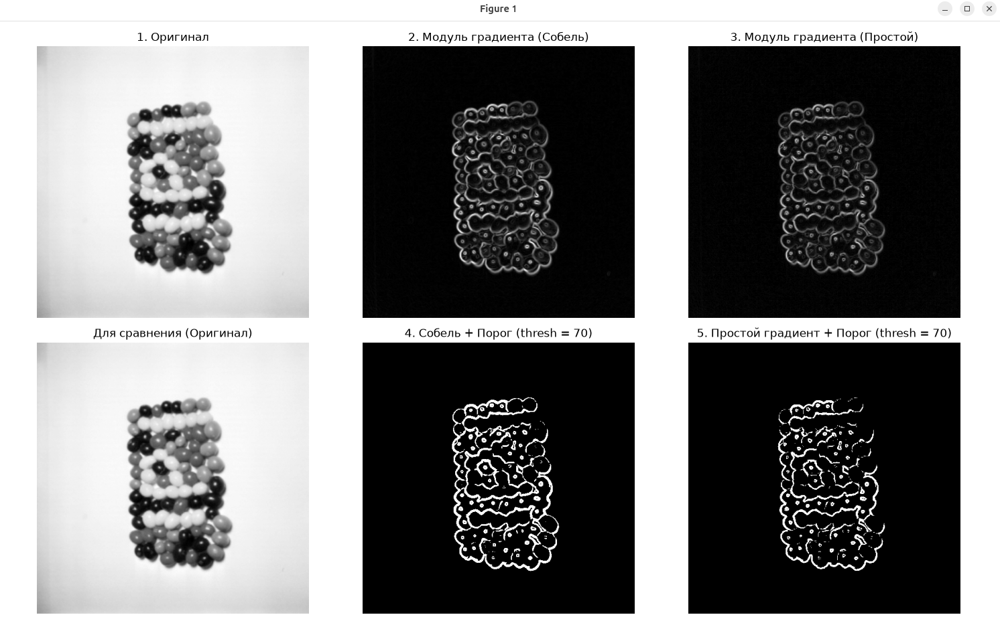
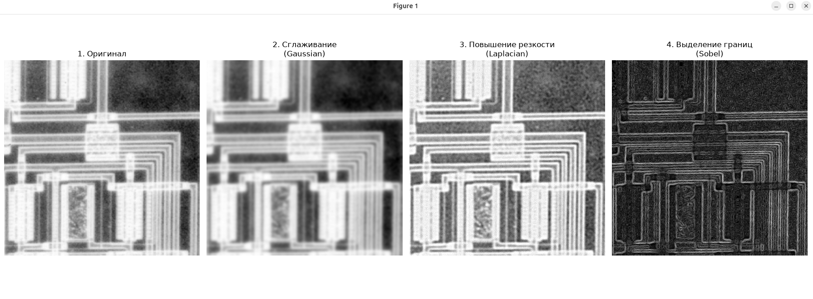

# Математические и компьютерные методы обработки изображений

## Лабораторная работа № 2

#### Выполнил: Валиков Егор

#### Группа: 19

---

## Задание 1: Исследование методов обработки границ при фильтрации изображений

### Задача

Исследовать влияние различных методов обработки границ (краевых эффектов) при выполнении линейной фильтрации (свертки) изображения. Сравнить результаты для методов: заполнение константой (`cv2.BORDER_CONSTANT`), повторение (`cv2.BORDER_REPLICATE`), отражение/симметрия (`cv2.BORDER_REFLECT`) и циклическое заполнение (`cv2.BORDER_WRAP`).

### Программа для решения

Ссылка на код: [`task1.py`](task1.py)

```py
import os
import cv2
import matplotlib.pyplot as plt
import numpy as np

# Путь к изображению
image_path = 'variant_4_1.jpg'

# Проверяем наличие файла
if not os.path.exists(image_path):
  raise FileNotFoundError(
      f"Файл '{image_path}' не найден! Проверьте путь к изображению."
  )

# Загрузка полутонового изображения
image = cv2.imread(image_path, cv2.IMREAD_GRAYSCALE)
if image is None:
  raise ValueError(
      f"Не удалось загрузить изображение из файла '{image_path}'."
  )

kernel_size = 9

# Создаем квадратное ядро фильтра
kernel = np.ones((kernel_size, kernel_size), dtype=np.float32) / (
    kernel_size * kernel_size
)

# Словарь методов обработки границ
methods = {
    'Заполнение нулями\n(Constant 0)': cv2.BORDER_CONSTANT,
    'Replicate\n(Повторение)': cv2.BORDER_REPLICATE,
    'Symmetric\n(Симметрия)': cv2.BORDER_REFLECT,
    'Circular\n(Циклическое)': cv2.BORDER_WRAP,
}

pad = kernel_size // 2
filtered_images = {}

for name, border_type in methods.items():
  try:
    filtered_images[name] = cv2.filter2D(
        image, -1, kernel, borderType=border_type
    )
  except cv2.error:
    if border_type == cv2.BORDER_WRAP:
      padded = np.pad(image, pad, mode='wrap')
    elif border_type == cv2.BORDER_REFLECT:
      padded = np.pad(image, pad, mode='reflect')
    elif border_type == cv2.BORDER_REPLICATE:
      padded = np.pad(image, pad, mode='edge')
    else:
      padded = np.pad(image, pad, mode='constant', constant_values=0)

    filtered_full = cv2.filter2D(
        padded, -1, kernel, borderType=cv2.BORDER_CONSTANT
    )
    h_orig, w_orig = image.shape
    filtered_images[name] = filtered_full[
        pad : pad + h_orig, pad : pad + w_orig
    ]

# Определяем область для среза границы
h, w = image.shape
crop_size = min(120, h, w)
crop_slice = (slice(0, crop_size), slice(0, crop_size))

fig, axes = plt.subplots(2, 5, figsize=(16, 7))

titles = [
    'Оригинал',
    'Заполнение нулями\n(Constant 0)',
    'Replicate\n(Повторение)',
    'Symmetric\n(Симметрия)',
    'Circular\n(Циклическое)',
]

# Изображения целиком
axes[0, 0].imshow(image, cmap='gray')
axes[0, 0].set_title(titles[0] + '\n(целиком)', fontsize=10)
axes[0, 0].axis('off')

for col_idx, (name, res_img) in enumerate(filtered_images.items(), start=1):
  axes[0, col_idx].imshow(res_img, cmap='gray')
  axes[0, col_idx].set_title(titles[col_idx] + '\n(целиком)', fontsize=10)
  axes[0, col_idx].axis('off')

# Фрагменты краев
axes[1, 0].imshow(image[crop_slice], cmap='gray')
axes[1, 0].set_title(titles[0] + '\n(фрагмент края)', fontsize=10)
axes[1, 0].axis('off')

for col_idx, (name, res_img) in enumerate(filtered_images.items(), start=1):
  axes[1, col_idx].imshow(res_img[crop_slice], cmap='gray')
  axes[1, col_idx].set_title(
      titles[col_idx] + '\n(фрагмент края)', fontsize=10
  )
  axes[1, col_idx].axis('off')

plt.tight_layout()
plt.show()
```

### Результаты обработки


На скриншоте представлены результаты применения различных методов обработки границ для изображения целиком, а также детальные фрагменты приграничных областей.

### Выводы по результатам

Различные методы обработки границ по-разному проявляют себя на периферии изображения:

- `BORDER_CONSTANT` создает искусственную темную рамку по краям из-за примеси нулевых значений.
- `BORDER_REPLICATE` растягивает крайние пиксели, что выглядит естественно для фоновых областей, но может искажать структуру контуров.
- `BORDER_REFLECT` обеспечивает зеркальное отражение пикселей, предотвращая резкие скачки яркости.
- `BORDER_WRAP` переносит противоположные стороны друг на друга, что применимо только для периодических текстур.

Рекомендации по использованию:

- Желательный размер ядра (`kernel_size`) для стандартных задач фильтрации составляет от `3 x 3` до `9 x 9`. Большие размеры (>= 15) приводят к сильному размытию краев и артефактам на границах.
- Для большинства реальных изображений рекомендуется использовать `cv2.BORDER_REFLECT` или `cv2.BORDER_REPLICATE`, так как они минимизируют появление ложных контрастных границ по периметру.

---

## Задание 2: Сравнение однородного и взвешенного усредняющих фильтров

### Задача

Реализовать программу, создающую обычный однородный усредняющий фильтр (`Box Filter`) и взвешенный усредняющий фильтр (`Gaussian Filter`). Сравнить их способность сохранять резкость краев и деталей изображения.

### Программа для решения

Ссылка на код: [`task2.py`](task2.py)

```py
import os
import cv2
import matplotlib.pyplot as plt
import numpy as np

# Путь к изображению
image_path = 'variant_4_2.jpg'

# Проверяем наличие файла
if not os.path.exists(image_path):
  raise FileNotFoundError(
      f"Файл '{image_path}' не найден! Проверьте путь к изображению."
  )

# Загрузка полутонового изображения
image = cv2.imread(image_path, cv2.IMREAD_GRAYSCALE)
if image is None:
  raise ValueError(
      f"Не удалось загрузить изображение из файла '{image_path}'."
  )

# Размер ядра фильтра
kernel_size = 15

# Обычный однородный усредняющий фильтр
# Все коэффициенты матрицы равны 1 / (kernel_size * kernel_size)
box_kernel = np.ones((kernel_size, kernel_size), dtype=np.float32) / (
    kernel_size * kernel_size
)
img_box = cv2.filter2D(image, -1, box_kernel)

# Взвешенный усредняющий фильтр (Фильтр Гаусса)
# Веса распределены по закону Гаусса (в центре максимальные, к краям убывают)
img_weighted = cv2.GaussianBlur(image, (kernel_size, kernel_size), sigmaX=0)

# Вырезаем фрагмент для сравнения краев
h, w = image.shape
crop_size = min(120, h, w)
crop_slice = (slice(0, crop_size), slice(0, crop_size))

fig, axes = plt.subplots(2, 3, figsize=(15, 8))

# Изображения целиком
axes[0, 0].imshow(image, cmap='gray')
axes[0, 0].set_title('Оригинал\n(целиком)')
axes[0, 0].axis('off')

axes[0, 1].imshow(img_box, cmap='gray')
axes[0, 1].set_title(
    f'Однородный фильтр (Box)\nразмер ядра: {kernel_size}x{kernel_size}'
)
axes[0, 1].axis('off')

axes[0, 2].imshow(img_weighted, cmap='gray')
axes[0, 2].set_title(
    f'Взвешенный фильтр (Gaussian)\nразмер ядра: {kernel_size}x{kernel_size}'
)
axes[0, 2].axis('off')

# Крупный план (фрагмент края/угла)
axes[1, 0].imshow(image[crop_slice], cmap='gray')
axes[1, 0].set_title('Оригинал\n(фрагмент)')
axes[1, 0].axis('off')

axes[1, 1].imshow(img_box[crop_slice], cmap='gray')
axes[1, 1].set_title('Однородный фильтр\n(фрагмент)')
axes[1, 1].axis('off')

axes[1, 2].imshow(img_weighted[crop_slice], cmap='gray')
axes[1, 2].set_title('Взвешенный фильтр\n(фрагмент)')
axes[1, 2].axis('off')

plt.tight_layout()
plt.show()
```

### Результаты обработки


На скриншоте приведены результаты фильтрации однородным (`Box`) и взвешенным (`Gaussian`) фильтрами на общем плане и на детализированных фрагментах.

### Выводы по результатам

Взвешенный фильтр Гаусса демонстрирует лучшие показатели сохранения структуры и контуров объектов по сравнению с однородным усреднением, поскольку распределение весов плавно убывает от центра к периферии.

Рекомендации по использованию:
- Для подавления шумов с минимальным размытием контуров рекомендуется использовать фильтр Гаусса (`cv2.GaussianBlur`).
- Оптимальные параметры: `kernel_size` в диапазоне от `3 x 3` до `11 x 11`. При больших значениях (`kernel_size` >= 15) детали полностью теряются. Параметр `sigmaX` лучше оставлять равным `0`, чтобы функция OpenCV автоматически рассчитала его на основе размера ядра.

---

## Задание 3: Выделение границ оператором Собеля и пороговое преобразование

### Задача

Применить оператор Собеля с пороговым преобразованием для выделения границ и сравнить полученный результат с простым пороговым преобразованием модуля градиента на базе конечных разностей.

### Программа для решения

Ссылка на код: [`task3.py`](task3.py)

```py
import os
import cv2
import matplotlib.pyplot as plt
import numpy as np

# Путь к изображению
image_path = 'variant_4_3.jpg'

# Проверяем наличие файла
if not os.path.exists(image_path):
  raise FileNotFoundError(
      f"Файл '{image_path}' не найден! Проверьте путь к изображению."
  )

# Загрузка полутонового изображения
image = cv2.imread(image_path, cv2.IMREAD_GRAYSCALE)
if image is None:
  raise ValueError(
      f"Не удалось загрузить изображение из файла '{image_path}'."
  )

# Оператор Собеля с пороговым преобразованием
# Вычисляем производные по X и Y с помощью встроенной функции Собеля (размер ядра 3x3)
sobel_x = cv2.Sobel(image, cv2.CV_64F, 1, 0, ksize=3)
sobel_y = cv2.Sobel(image, cv2.CV_64F, 0, 1, ksize=3)

# Вычисляем модуль градиента: M = sqrt(Gx^2 + Gy^2)
sobel_mag = cv2.magnitude(sobel_x, sobel_y)

# Нормализуем в диапазон 0-255 для удобства применения порога
sobel_mag_u8 = cv2.normalize(
    sobel_mag, None, 0, 255, cv2.NORM_MINMAX, dtype=cv2.CV_8U
)

# Пороговое преобразование для Собеля
# Пиксели выше порога станут белыми (255), ниже — черными (0)
threshold_value = 70
_, sobel_thresh = cv2.threshold(
    sobel_mag_u8, threshold_value, 255, cv2.THRESH_BINARY
)

# Простой градиент с пороговым преобразованием
# Простые ядра для поиска разностей соседних пикселей
simple_kernel_x = np.array([[-1, 1]], dtype=np.float32)
simple_kernel_y = np.array([[-1], [1]], dtype=np.float32)

simple_x = cv2.filter2D(image, cv2.CV_64F, simple_kernel_x)
simple_y = cv2.filter2D(image, cv2.CV_64F, simple_kernel_y)

# Модуль простого градиента
simple_mag = cv2.magnitude(simple_x, simple_y)
simple_mag_u8 = cv2.normalize(
    simple_mag, None, 0, 255, cv2.NORM_MINMAX, dtype=cv2.CV_8U
)

# Пороговое преобразование для простого градиента
_, simple_thresh = cv2.threshold(
    simple_mag_u8, threshold_value, 255, cv2.THRESH_BINARY
)

fig, axes = plt.subplots(2, 3, figsize=(15, 9))

# Исходное изображение и модули градиентов
axes[0, 0].imshow(image, cmap='gray')
axes[0, 0].set_title('1. Оригинал')
axes[0, 0].axis('off')

axes[0, 1].imshow(sobel_mag_u8, cmap='gray')
axes[0, 1].set_title('2. Модуль градиента (Собель)')
axes[0, 1].axis('off')

axes[0, 2].imshow(simple_mag_u8, cmap='gray')
axes[0, 2].set_title('3. Модуль градиента (Простой)')
axes[0, 2].axis('off')

# Результаты после порогового преобразования
axes[1, 0].imshow(image, cmap='gray')
axes[1, 0].set_title('Для сравнения (Оригинал)')
axes[1, 0].axis('off')

axes[1, 1].imshow(sobel_thresh, cmap='gray')
axes[1, 1].set_title(f'4. Собель + Порог (thresh = {threshold_value})')
axes[1, 1].axis('off')

axes[1, 2].imshow(simple_thresh, cmap='gray')
axes[1, 2].set_title(f'5. Простой градиент + Порог (thresh = {threshold_value})')
axes[1, 2].axis('off')

plt.tight_layout()
plt.show()
```

### Результаты обработки



На скриншоте представлены промежуточные модули градиентов и бинарные карты границ после применения порогового преобразования для обоих методов.

### Выводы по результатам

Оператор Собеля за счет встроенного сглаживания по перпендикулярной оси эффективнее подавляет высокочастотный шум и выделяет более слитные и непрерывные контуры по сравнению с простыми конечными разностями.

Рекомендации по использованию:
- Размер ядра `ksize` для оператора Собеля рекомендуется устанавливать равным `3` (или `5` для сильного зашумления). Использование `ksize = -1` подключает ядро Шарра (`Scharr`), обеспечивающее высокую точность на диагональных границах.
- Пороговое значение (`threshold_value`) следует подбирать экспериментально в зависимости от контрастности сцены (в среднем в диапазоне от 50 до 120 при 8-битной шкале).

---

## Задание 4: Комплексный конвейер обработки (Сглаживание -> Резкость -> Границы)

### Задача

Разработать программу, объединяющую несколько методов: предварительное сглаживание изображения, повышение резкости с помощью Лапласиана и последующее выделение краев оператором Собеля.

### Программа для решения

Ссылка на код: [`task4.py`](task4.py)

```py
import os
import cv2
import matplotlib.pyplot as plt
import numpy as np

# Путь к изображению
image_path = 'variant_4_4.jpg'

# Проверяем наличие файла
if not os.path.exists(image_path):
  raise FileNotFoundError(
      f"Файл '{image_path}' не найден! Проверьте путь к изображению."
  )

# Загрузка полутонового изображения
image = cv2.imread(image_path, cv2.IMREAD_GRAYSCALE)
if image is None:
  raise ValueError(
      f"Не удалось загрузить изображение из файла '{image_path}'."
  )

# Сглаживающий фильтр (Фильтр Гаусса)
# Убираем шум, размер ядра
kernel_size_smooth = 15
img_smoothed = cv2.GaussianBlur(
    image, (kernel_size_smooth, kernel_size_smooth), sigmaX=0
)

# Повышение резкости с помощью Лапласиана
# Применяем Лапласиан для выделения вторых производных
laplacian = cv2.Laplacian(img_smoothed, cv2.CV_64F, ksize=3)

# Нормализуем результат Лапласиана в диапазон 0-255
laplacian_u8 = cv2.normalize(
    np.abs(laplacian), None, 0, 255, cv2.NORM_MINMAX, dtype=cv2.CV_8U
)

# Метод повышения резкости
# img_sharpened = img_smoothed - c * laplacian (c — коэффициент усиления)
img_float = img_smoothed.astype(np.float64)
lap_float = laplacian.astype(np.float64)
alpha = 5  # Коэффициент влияния резкости
img_sharpened_float = img_float - alpha * lap_float
img_sharpened = np.clip(img_sharpened_float, 0, 255).astype(np.uint8)

# Выделение краев оператором Собеля
sobel_x = cv2.Sobel(img_sharpened, cv2.CV_64F, 1, 0, ksize=3)
sobel_y = cv2.Sobel(img_sharpened, cv2.CV_64F, 0, 1, ksize=3)
sobel_mag = cv2.magnitude(sobel_x, sobel_y)

# Нормализуем модуль градиента Собеля
img_edges = cv2.normalize(
    sobel_mag, None, 0, 255, cv2.NORM_MINMAX, dtype=cv2.CV_8U
)

fig, axes = plt.subplots(1, 4, figsize=(18, 5))

# Отображаем каждый этап обработки
axes[0].imshow(image, cmap='gray')
axes[0].set_title('1. Оригинал')
axes[0].axis('off')

axes[1].imshow(img_smoothed, cmap='gray')
axes[1].set_title('2. Сглаживание\n(Gaussian)')
axes[1].axis('off')

axes[2].imshow(img_sharpened, cmap='gray')
axes[2].set_title('3. Повышение резкости\n(Laplacian)')
axes[2].axis('off')

axes[3].imshow(img_edges, cmap='gray')
axes[3].set_title('4. Выделение границ\n(Sobel)')
axes[3].axis('off')

plt.tight_layout()
plt.show()
```

### Результаты обработки



На скриншоте последовательно отображены все этапы конвейера: исходный кадр, результат сглаживания Гаусса, усиление резкости через Лапласиан и итоговая карта границ Собеля.

### Выводы по результатам

Поэтапное применение фильтров позволяет эффективно управлять качеством контурного анализа. Предварительное сглаживание убирает ненужные шумы, Лапласиан подчеркивает перепады яркости, а Собель формирует итоговые четкие линии объектов.

Рекомендации по использованию:
- Для параметра сглаживания рекомендуется выбирать kernel_size_smooth в пределах `5 x 5` - `15 x 15` в зависимости от уровня зашумленности исходного изображения.
- Коэффициент усиления резкости alpha следует держать на уровне `0.5 - 2.0` (при слишком больших значениях > 5 усиливаются артефакты и фоновые шумы).
- Размер ядра Лапласиана (`ksize`) и Собеля оптимально оставлять стандартным (`3`), чтобы избежать избыточной толщины контуров.

---

## Общие выводы

В ходе выполнения лабораторной работы были изучены базовые и продвинутые методы пространственной фильтрации изображений. Практически доказано влияние краевых эффектов и способов их компенсации, оценена эффективность взвешенных фильтров по сравнению с однородными, а также реализованы алгоритмы выделения границ с использованием градиентных операторов и комплексных конвейеров обработки. Предложенные рекомендации по подбору параметров позволяют добиваться оптимального качества обработки визуальных данных.
