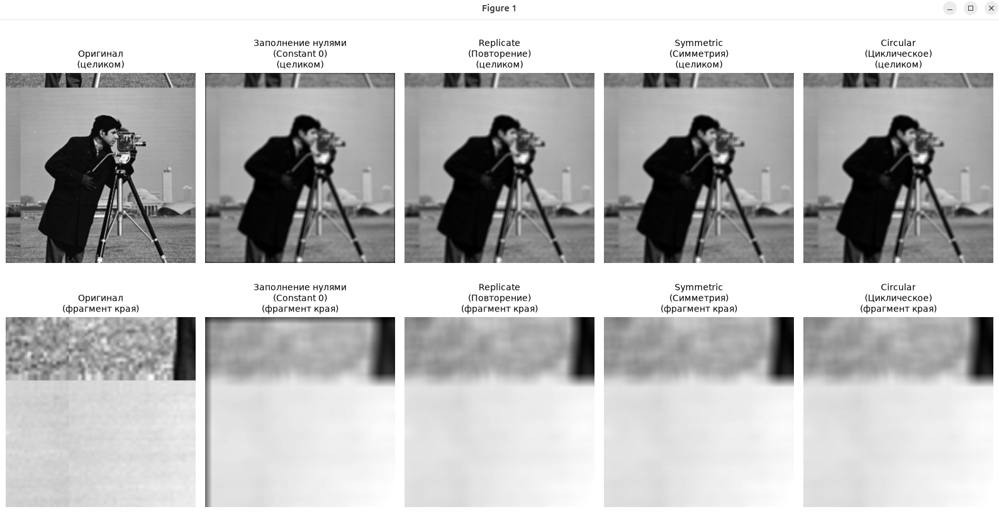

# Математические и компьютерные методы обработки изображений

## Лабораторная работа № 2

#### Выполнил: Валиков Егор

#### Группа: 19

---

## Задание 1: Исследование методов обработки границ при фильтрации изображений

### Задача

Исследовать влияние различных методов обработки границ (краевых эффектов) при выполнении линейной фильтрации (свертки) изображения. Сравнить результаты для методов: заполнение константой (`cv2.BORDER_CONSTANT`), повторение (`cv2.BORDER_REPLICATE`), отражение/симметрия (`cv2.BORDER_REFLECT`) и циклическое заполнение (`cv2.BORDER_WRAP`).

### Программа для решения

Ссылка на код: [`task1.py`](task1.py)

```py
import os
import cv2
import matplotlib.pyplot as plt
import numpy as np

# Путь к изображению
image_path = 'variant_4_1.jpg'

# Проверяем наличие файла
if not os.path.exists(image_path):
  raise FileNotFoundError(
      f"Файл '{image_path}' не найден! Проверьте путь к изображению."
  )

# Загрузка полутонового изображения
image = cv2.imread(image_path, cv2.IMREAD_GRAYSCALE)
if image is None:
  raise ValueError(
      f"Не удалось загрузить изображение из файла '{image_path}'."
  )

kernel_size = 9

# Создаем квадратное ядро фильтра
kernel = np.ones((kernel_size, kernel_size), dtype=np.float32) / (
    kernel_size * kernel_size
)

# Словарь методов обработки границ
methods = {
    'Заполнение нулями\n(Constant 0)': cv2.BORDER_CONSTANT,
    'Replicate\n(Повторение)': cv2.BORDER_REPLICATE,
    'Symmetric\n(Симметрия)': cv2.BORDER_REFLECT,
    'Circular\n(Циклическое)': cv2.BORDER_WRAP,
}

pad = kernel_size // 2
filtered_images = {}

for name, border_type in methods.items():
  try:
    filtered_images[name] = cv2.filter2D(
        image, -1, kernel, borderType=border_type
    )
  except cv2.error:
    if border_type == cv2.BORDER_WRAP:
      padded = np.pad(image, pad, mode='wrap')
    elif border_type == cv2.BORDER_REFLECT:
      padded = np.pad(image, pad, mode='reflect')
    elif border_type == cv2.BORDER_REPLICATE:
      padded = np.pad(image, pad, mode='edge')
    else:
      padded = np.pad(image, pad, mode='constant', constant_values=0)

    filtered_full = cv2.filter2D(
        padded, -1, kernel, borderType=cv2.BORDER_CONSTANT
    )
    h_orig, w_orig = image.shape
    filtered_images[name] = filtered_full[
        pad : pad + h_orig, pad : pad + w_orig
    ]

# Определяем область для среза границы
h, w = image.shape
crop_size = min(120, h, w)
crop_slice = (slice(0, crop_size), slice(0, crop_size))

fig, axes = plt.subplots(2, 5, figsize=(16, 7))

titles = [
    'Оригинал',
    'Заполнение нулями\n(Constant 0)',
    'Replicate\n(Повторение)',
    'Symmetric\n(Симметрия)',
    'Circular\n(Циклическое)',
]

# Изображения целиком
axes[0, 0].imshow(image, cmap='gray')
axes[0, 0].set_title(titles[0] + '\n(целиком)', fontsize=10)
axes[0, 0].axis('off')

for col_idx, (name, res_img) in enumerate(filtered_images.items(), start=1):
  axes[0, col_idx].imshow(res_img, cmap='gray')
  axes[0, col_idx].set_title(titles[col_idx] + '\n(целиком)', fontsize=10)
  axes[0, col_idx].axis('off')

# Фрагменты краев
axes[1, 0].imshow(image[crop_slice], cmap='gray')
axes[1, 0].set_title(titles[0] + '\n(фрагмент края)', fontsize=10)
axes[1, 0].axis('off')

for col_idx, (name, res_img) in enumerate(filtered_images.items(), start=1):
  axes[1, col_idx].imshow(res_img[crop_slice], cmap='gray')
  axes[1, col_idx].set_title(
      titles[col_idx] + '\n(фрагмент края)', fontsize=10
  )
  axes[1, col_idx].axis('off')

plt.tight_layout()
plt.show()
```

### Результаты обработки



На скриншоте представлены результаты применения различных методов обработки границ для изображения целиком, а также детальные фрагменты приграничных областей.

### Выводы по результатам

Различные методы обработки границ по-разному проявляют себя на периферии изображения:

- `BORDER_CONSTANT` создает искусственную темную рамку по краям из-за примеси нулевых значений.
- `BORDER_REPLICATE` растягивает крайние пиксели, что выглядит естественно для фоновых областей, но может искажать структуру контуров.
- `BORDER_REFLECT` обеспечивает зеркальное отражение пикселей, предотвращая резкие скачки яркости.
- `BORDER_WRAP` переносит противоположные стороны друг на друга, что применимо только для периодических текстур.

Рекомендации по использованию:

- Желательный размер ядра (`kernel_size`) для стандартных задач фильтрации составляет от $3 \times 3$ до $9 \times 9$. Большие размеры ($\ge 15$) приводят к сильному размытию краев и артефактам на границах.
- Для большинства реальных изображений рекомендуется использовать `cv2.BORDER_REFLECT` или `cv2.BORDER_REPLICATE`, так как они минимизируют появление ложных контрастных границ по периметру.

---
