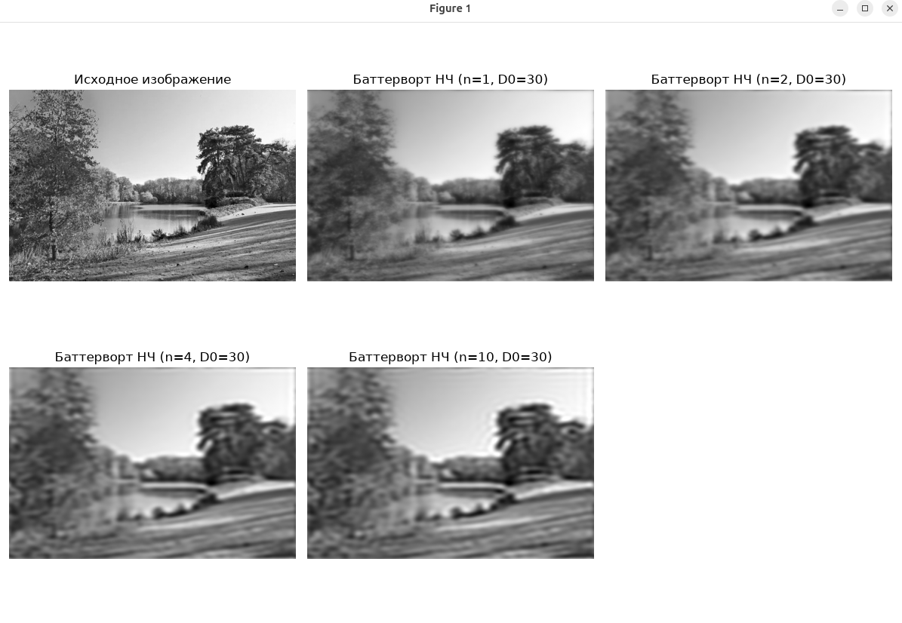
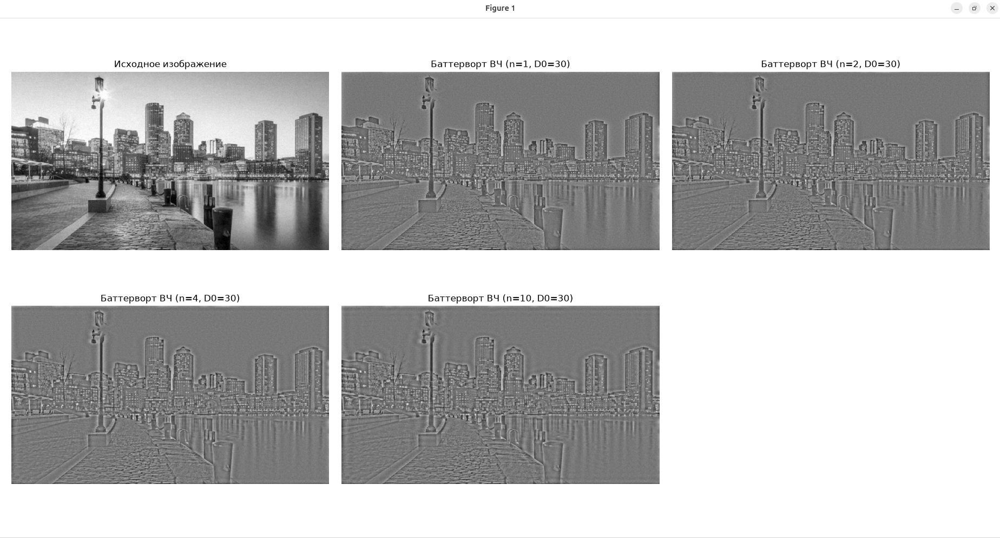
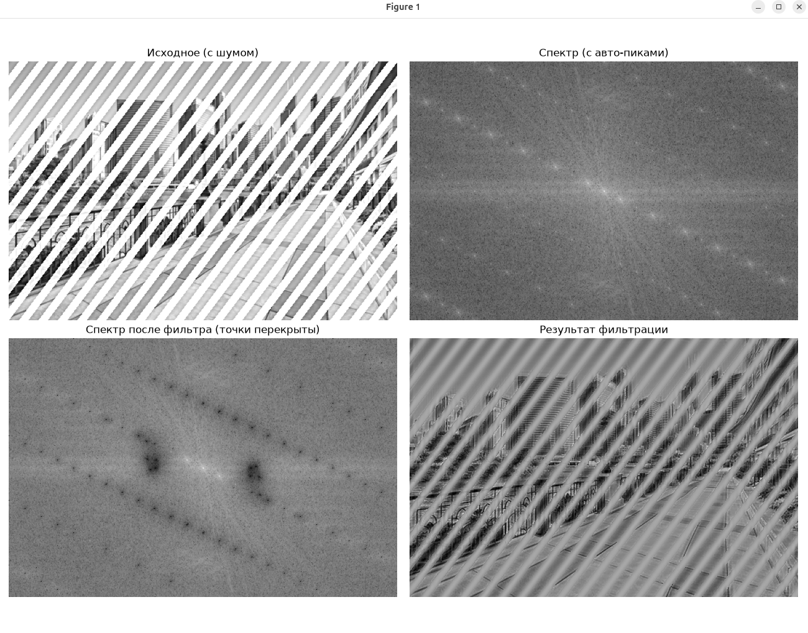

# Математические и компьютерные методы обработки изображений

## Лабораторная работа № 3

#### Выполнил: Валиков Егор

#### Группа: 19

---

## Задание 1: Исследование низкочастотной фильтрации (фильтр Баттерворта НЧ)

### Задача

Исследовать влияние порядка фильтра `n` на результаты низкочастотной фильтрации изображения в частотной области с использованием фильтра Баттерворта низких частот (НЧ).

### Программа для решения

Ссылка на код: [`task1.py`](task1.py)

```py
import cv2
import numpy as np
import matplotlib.pyplot as plt

# Загрузка изображения
image_path = 'task_1_lowpass.png'
img = cv2.imread(image_path, cv2.IMREAD_GRAYSCALE)

# Проверка
if img is None:
    raise FileNotFoundError(f"Ошибка: Не удалось загрузить изображение по пути '{image_path}'. Проверьте имя файла и путь к нему.")

img = img.astype(np.float32)
rows, cols = img.shape

# Центрирование спектра (умножение на (-1)^(x+y))
u = np.arange(rows)
v = np.arange(cols)
U, V = np.meshgrid(u, v, indexing='ij')
centered_img = img * ((-1) ** (U + V))

# Прямое двумерное БПФ
f_transform = np.fft.fft2(centered_img)

# Функция создания фильтра Баттерворта НЧ
def butterworth_lowpass(shape, D0, n):
    rows, cols = shape
    center_r, center_c = rows // 2, cols // 2
    u = np.arange(rows)
    v = np.arange(cols)
    U, V = np.meshgrid(u, v, indexing='ij')
    
    # Расстояние от каждой точки до центра
    D = np.sqrt((U - center_r) ** 2 + (V - center_c) ** 2)
    
    # Передаточная функция фильтра Баттерворта
    H = 1.0 / (1.0 + (D / D0) ** (2 * n))
    return H

# Параметры из задания
D0 = 30
orders = [1, 2, 4, 10] # Исследуем влияние порядка

plt.figure(figsize=(12, 8))
plt.subplot(2, 3, 1)
plt.imshow(img, cmap='gray')
plt.title('Исходное изображение')
plt.axis('off')

for i, n in enumerate(orders):
    # Создаем фильтр
    H = butterworth_lowpass((rows, cols), D0, n)
    
    # Применение фильтра
    filtered_f = f_transform * H
    
    # Обратное БПФ
    inv_fft = np.fft.ifft2(filtered_f)
    
    # Убираем центрирование и берем вещественную часть
    result = np.real(inv_fft) * ((-1) ** (U + V))
    
    # Нормализация для отображения
    result = np.clip(result, 0, 255)
    
    plt.subplot(2, 3, i + 2)
    plt.imshow(result, cmap='gray')
    plt.title(f'Баттерворт НЧ (n={n}, D0={D0})')
    plt.axis('off')

plt.tight_layout()
plt.show()
```

### Результаты обработки



На полученном скриншоте продемонстрировано сглаживание изображения с помощью фильтра Баттерворта НЧ при порядках `n = 1, 2, 4, 10`.

### Выводы по результатам

Низкочастотная фильтрация в частотной области эффективно подавляет мелкие детали и высокочастотный шум. Изменение порядка фильтра $n$ влияет на крутизну среза частотной характеристики:
- При малых значениях (`n = 1, 2`) переход является плавным, что дает умеренное размытие.
- При больших значениях (`n = 10`) фильтр приближается к идеальному прямоугольному фильтру, что приводит к появлению заметных кольцевых артефактов (эффекта звона) вокруг резких границ.

Рекомендации по использованию:
- Оптимальный порядок фильтра Баттерворта НЧ — `n = 2` или `n = 4`, что обеспечивает баланс между сглаживанием шумов и минимизацией артефактов звона.
- Частоту среза `D_0` следует выбирать исходя из масштаба деталей: меньшие значения сильнее размывают изображение, большие — оставляют больше высокочастотных компонентов.

---

## Задание 2: Высокочастотная фильтрация в частотной области (фильтр Баттерворта ВЧ)

### Задача

Реализовать фильтр Баттерворта высоких частот (ВЧ) для подчеркивания контуров и мелких деталей изображения в частотной области, исследовав влияние различных порядков фильтра `n`.

### Программа для решения

Ссылка на код: [`task2.py`](task2.py)

```py
import cv2
import numpy as np
import matplotlib.pyplot as plt

# Загрузка изображения
image_path = 'task_2_highpass.png'
img = cv2.imread(image_path, cv2.IMREAD_GRAYSCALE)

if img is None:
    raise FileNotFoundError(f"Ошибка: Не удалось загрузить изображение по пути '{image_path}'. Проверьте имя файла и путь к нему.")

img = img.astype(np.float32)
rows, cols = img.shape

# Центрирование спектра (умножение на (-1)^(x+y))
u = np.arange(rows)
v = np.arange(cols)
U, V = np.meshgrid(u, v, indexing='ij')
centered_img = img * ((-1) ** (U + V))

# Прямое двумерное БПФ
f_transform = np.fft.fft2(centered_img)

# Функция создания фильтра Баттерворта ВЧ (HPF)
def butterworth_highpass(shape, D0, n):
    rows, cols = shape
    center_r, center_c = rows // 2, cols // 2
    u = np.arange(rows)
    v = np.arange(cols)
    U, V = np.meshgrid(u, v, indexing='ij')
    
    # Расстояние от центра спектра
    D = np.sqrt((U - center_r) ** 2 + (V - center_c) ** 2)
    
    # Избегаем деления на ноль в центре спектра (D = 0)
    D = np.where(D == 0, 1e-10, D)
    
    # Передаточная функция фильтра Баттерворта ВЧ
    H = 1.0 / (1.0 + (D0 / D) ** (2 * n))
    return H

# Параметры из задания
D0 = 30
orders = [1, 2, 4, 10]

plt.figure(figsize=(12, 8))
plt.subplot(2, 3, 1)
plt.imshow(img, cmap='gray')
plt.title('Исходное изображение')
plt.axis('off')

for i, n in enumerate(orders):
    # Создаем фильтр ВЧ для текущего порядка n
    H = butterworth_highpass((rows, cols), D0, n)
    
    # Применение фильтра в частотной области
    filtered_f = f_transform * H
    
    # Обратное БПФ
    inv_fft = np.fft.ifft2(filtered_f)
    result = np.real(inv_fft) * ((-1) ** (U + V))
    
    # Нормализация
    result = cv2.normalize(result, None, alpha=0, beta=255, norm_type=cv2.NORM_MINMAX)
    result = np.clip(result, 0, 255)
    plt.subplot(2, 3, i + 2)
    plt.imshow(result, cmap='gray')
    plt.title(f'Баттерворт ВЧ (n={n}, D0={D0})')
    plt.axis('off')

plt.tight_layout()
plt.show()
```

### Результаты обработки



На скриншоте показано выделение высокочастотных деталей (контуров и границ) при различных порядках фильтра Баттерворта ВЧ.

### Выводы по результатам

Фильтр Баттерворта ВЧ эффективно удаляет низкочастотные составляющие (общий фон и плавные переходы яркости), оставляя контрастными резкие границы объектов. Повышение порядка `n` делает переходную зону более резкой, увеличивая контрастность контуров, но одновременно усиливая шум и артефакты.

Рекомендации по использованию:
- Для качественного подчеркивания границ без избыточного усиления шума рекомендуется использовать порядок `n = 1` или `n = 2`.
- Частоту среза `D_0` следует настраивать в зависимости от размеров объектов, детали которых необходимо выделить.

---

## Задание 3: Подавление периодического шума с помощью автоматического режекторного фильтра

### Задача

Разработать алгоритм автоматического поиска шумовых пиков в спектре Фурье зашумленного изображения и применить многоточечный гауссовский режекторный фильтр для устранения периодического (диагонального) растрового шума.

### Программа для решения

Ссылка на код: [`task3.py`](task3.py)

```py
import cv2
import numpy as np
import matplotlib.pyplot as plt

# Загрузка изображения
image_path = 'task_3_periodic.png'
img = cv2.imread(image_path, cv2.IMREAD_GRAYSCALE)

if img is None:
    raise FileNotFoundError(f"Ошибка: Не удалось загрузить изображение по пути '{image_path}'. Проверьте имя файла и путь к нему.")

img = img.astype(np.float32)
rows, cols = img.shape

# Прямое двумерное БПФ и сдвиг центра спектра
f_transform = np.fft.fft2(img)
f_shifted = np.fft.fftshift(f_transform)

# Автоматическое формирование массива координат шумовых пиков
mag = np.abs(f_shifted)
spec_log = np.log(1 + mag)

center_r, center_c = rows // 2, cols // 2
mask_dc_size = 55 # Размер зоны исключения центральной DC-компоненты
spec_log_no_dc = spec_log.copy()
spec_log_no_dc[center_r - mask_dc_size:center_r + mask_dc_size, 
               center_c - mask_dc_size:center_c + mask_dc_size] = 0

# Порог для выделения самых ярких пиков шума
threshold = np.percentile(spec_log_no_dc, 99.9)
peak_mask = (spec_log_no_dc > threshold).astype(np.uint8) * 255

# Поиск белых точек в спектре
num_labels, labels, stats, centroids = cv2.connectedComponentsWithStats(peak_mask)

# Формируем массив координат (u0, v0) для каждой найденной точки
notch_coords = []
for i in range(1, num_labels):
    c_x, c_y = centroids[i]
    u0 = int(round(c_y - center_r))
    v0 = int(round(c_x - center_c))
    notch_coords.append((u0, v0))

print(f"Автоматически сформированный массив координат пиков: {notch_coords}")

D0 = 25  # Ширина полосы подавления

# Функция создания гауссовского режекторного фильтра
def gaussian_notch_filter_array(shape, notch_pairs, D0):
    rows, cols = shape
    center_r, center_c = rows // 2, cols // 2
    
    u = np.arange(rows)
    v = np.arange(cols)
    U, V = np.meshgrid(u, v, indexing='ij')
    
    # Инициализируем маску фильтра единицами
    H = np.ones((rows, cols), dtype=np.float32)
    
    # Проходим по каждой паре координат из массива и перемножаем фильтры
    for (u0, v0) in notch_pairs:
        D1 = np.sqrt((U - center_r - u0) ** 2 + (V - center_c - v0) ** 2)
        D2 = np.sqrt((U - center_r + u0) ** 2 + (V - center_c + v0) ** 2)
        
        D1 = np.where(D1 == 0, 1e-10, D1)
        D2 = np.where(D2 == 0, 1e-10, D2)
        
        H_k = 1.0 - np.exp(-0.5 * ((D1 * D2) / (D0 ** 2)))
        H *= H_k
        
    return H

# Если вдруг автоматика ничего не нашла, зададим безопасный запасной вариант
if not notch_coords:
    notch_coords = [(0, 0)]

# Создание итоговой маски фильтра по массиву координат
H = gaussian_notch_filter_array((rows, cols), notch_coords, D0)

# Применение фильтра на сдвинутом спектре
filtered_shifted = f_shifted * H

# Обратное преобразование Фурье
f_ishift = np.fft.ifftshift(filtered_shifted)
inv_fft = np.fft.ifft2(f_ishift)
result = np.real(inv_fft)
result = np.clip(result, 0, 255)

plt.figure(figsize=(10, 10))

plt.subplot(2, 2, 1)
plt.imshow(img, cmap='gray')
plt.title('Исходное (с шумом)')
plt.axis('off')

plt.subplot(2, 2, 2)
spec_orig = np.log(1 + np.abs(f_shifted))
plt.imshow(spec_orig, cmap='gray')
plt.title('Спектр (с авто-пиками)')
plt.axis('off')

plt.subplot(2, 2, 3)
spec_filtered = np.log(1 + np.abs(filtered_shifted))
plt.subplot(2, 2, 3)
plt.imshow(spec_filtered, cmap='gray')
plt.title('Спектр после фильтра (точки перекрыты)')
plt.axis('off')

plt.subplot(2, 2, 4)
plt.imshow(result, cmap='gray')
plt.title('Результат фильтрации')
plt.axis('off')

plt.tight_layout()
plt.show()
```

### Результаты обработки



Алгоритм успешно обнаружил координаты пиков периодического шума в спектре Фурье, заблокировал их с помощью гауссовских режекторных фильтров и восстановил структуру изображения без диагональных полос.

### Выводы по результатам

Автоматический анализ спектра позволяет эффективно находить и подавлять периодические помехи без необходимости ручного подбора координат. Использование многоточечного режекторного фильтра гарантирует полное перекрытие всех гармоник шума.

Рекомендации по использованию:
- Размер зоны исключения центральной компоненты (`mask_dc_size`) следует устанавливать достаточно большим (например, 55 пикселей), чтобы яркое центральное ядро спектра не определялось как ложный шум.
- Ширину полосы подавления `D_0`) рекомендуется выбирать в диапазоне от 15 до 25 в зависимости от толщины и яркости шумовых полос.

---
